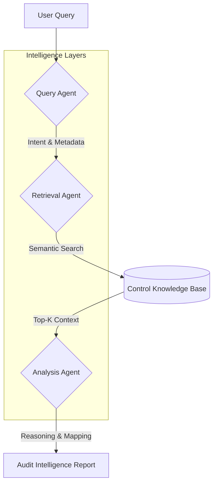

# 🛡️ GRC Intelligence Engine

### **Enterprise AI-Powered Cybersecurity Compliance Intelligence Platform**

The **GRC Intelligence Engine** is a production-grade cybersecurity compliance platform designed to automate the complex lifecycle of audit reasoning, control retrieval, and risk analysis. By leveraging a high-performance **Agentic Workflow** and **Semantic Retrieval (RAG)**, the engine transforms raw compliance queries into structured, audit-ready intelligence reports.

Designed for security teams, auditors, and compliance analysts, the platform bridges the gap between natural language inquiries and formal frameworks like **SOC 2, ISO 27001, GDPR, and NIST CSF**.

---

## 🏗️ Architecture & Agentic Workflow

The platform utilizes a modular, multi-agent architecture where discrete reasoning layers collaborate to ensure high-fidelity outputs. This design ensures that every audit response is grounded in the underlying control knowledge base.



### **The Three-Pillar Agent System**

* **Query Agent:** Performs intent detection and semantic preprocessing. It deconstructs natural language into high-dimensional vectors to identify the core compliance domain.
* **Retrieval Agent:** Powered by **SentenceTransformers (`all-MiniLM-L6-v2`)**, this agent executes a semantic search against the control repository. It uses **Cosine Similarity** to rank controls based on conceptual relevance rather than simple keyword matches.
* **Analysis Agent:** The reasoning core. It synthesizes retrieved controls, performs risk classification, maps framework cross-references, and identifies specific evidence requirements.

---

## 🚀 Key Features

* **Semantic Retrieval Engine:** Moves beyond fragile keyword matching to understand compliance context (e.g., recognizing that "user entry" and "identity management" both relate to Access Control).
* **Multi-Framework Mapping:** Automatically cross-references findings across **SOC 2, ISO 27001, GDPR, and NIST CSF**.
* **Risk Reasoning Engine:** Categorizes risks (Critical to Low) based on control gaps and impact analysis.
* **Evidence Requirement Mapping:** Generates a specific checklist of artifacts (logs, policies, screenshots) required to satisfy an auditor's request.
* **Enterprise Dashboard:** A premium, dark-mode Streamlit interface optimized for Security Operations Center (SOC) environments.
* **Scalable RAG Design:** Architected for seamless integration with vector databases like **ChromaDB** and automated PDF ingestion.

---

## 🛠️ Tech Stack

| Component | Technology |
| --- | --- |
| **Frontend** | Streamlit (Enterprise UI/UX) |
| **Reasoning Engine** | Agentic Workflow Design |
| **Embeddings** | SentenceTransformers (`all-MiniLM-L6-v2`) |
| **Vector Math** | Cosine Similarity Ranking |
| **Data Orchestration** | Pandas, Python 3.9+ |
| **Environment** | Dotenv (.env), VS Code Workflow |

---

## 📁 Project Structure

```text
grc-intelligence-engine/
├── .env                # Environment variables & configurations
├── requirements.txt    # Production dependencies
├── streamlit_app.py    # Main Enterprise Dashboard
├── data/
│   └── SOC2_tracker.csv # Structured Control Knowledge Base
├── agents/             # Modular Agent Logic
│   ├── query_agent.py
│   ├── retrieval_agent.py
│   └── analysis_agent.py
└── scripts/            # CLI Tools & Maintenance

```

---

## 💻 Installation & Local Deployment

### **Prerequisites**

* Python 3.9 or higher
* Virtual environment (recommended)

### **1. Clone the Repository**

```bash
git clone https://github.com/your-username/grc-intelligence-engine.git
cd grc-intelligence-engine

```

### **2. Setup Environment**

```bash
python -m venv venv
source venv/bin/activate  # Windows: venv\Scripts\activate
pip install -r requirements.txt

```

### **3. Configure Knowledge Base**

Place your control data in `data/SOC2_tracker- Sheet1.csv`. The engine expects columns including:

* `Control ID`
* `Control Name`
* `Description`
* `Evidence Required`
* `Owner`

---

## 🖥️ Usage

### **Launch the Dashboard**

Experience the full enterprise UI by running:

```bash
streamlit run streamlit_app.py

```

### **Example Queries**

* *"How is sensitive customer data protected at rest and in transit?"*
* *"What are our requirements for multi-factor authentication (MFA)?"*
* *"Show me the incident response controls for SOC 2 compliance."*

---

## 🗺️ Roadmap

* [ ] **Vector Database Integration:** Migration from in-memory similarity to **ChromaDB** for massive scale.
* [ ] **Automated Ingestion:** PDF/Docx parser to ingest existing company policies directly into the knowledge base.
* [ ] **Consensus Reasoning:** Integration with LLMs (OpenAI/Anthropic) to provide deeper narrative analysis.
* [ ] **Export Engine:** Generate formal Audit Readiness Reports in PDF/JSON formats.

---

## 🛡️ Security & Compliance Positioning

This platform is built to handle sensitive compliance data. It emphasizes **Deterministic Retrieval**—ensuring that while the query understanding is semantic, the actual controls returned are strictly sourced from your approved internal data, preventing AI "hallucinations" in a high-stakes audit context.

---

## 👤 Author

**Rewa Shukla**

**Cybersecurity | GRC | AI Engineering**

[LinkedIn](https://www.linkedin.com/in/rewa-shukla-320b02301) | rewashukla04@gmail.com

---

*Disclaimer: This platform is a decision-support tool designed to assist compliance professionals. Final audit determinations should always be reviewed by a qualified GRC expert.*